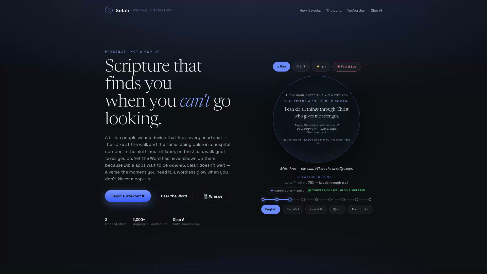
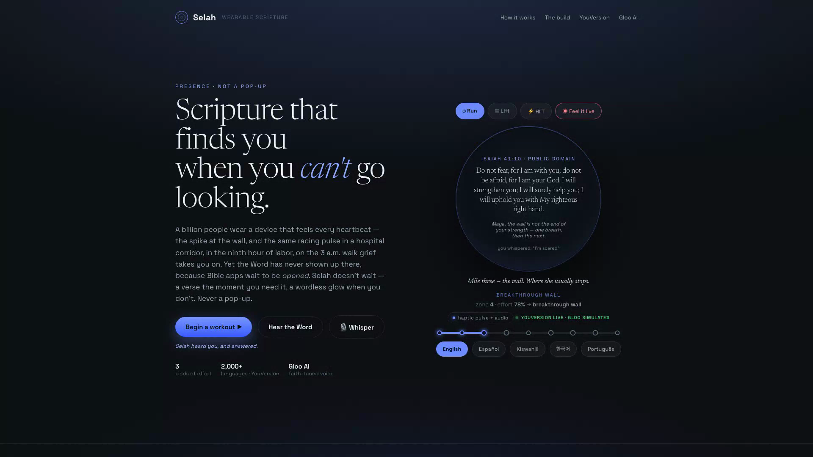
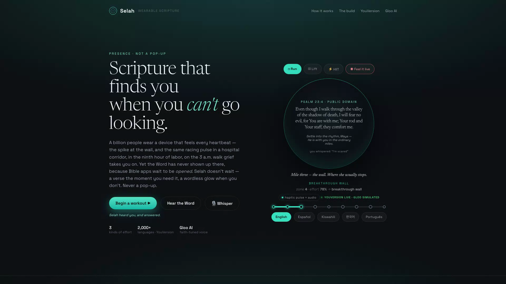

# Selah — Scripture at the right physiological moment

[](https://github.com/petitgen-ltd/selah-scripture/actions/workflows/ci.yml) · **License MIT** · **46 tests**

**A wearable-native Scripture companion for the [Scripture in New Frontiers](https://www.kaggle.com/competitions/scripture-in-new-frontiers) hackathon (YouVersion × Gloo).**

> Not another Bible app. **Scripture that finds you when you can't go looking** — for the moments you can't open an app: the wall on a run, the hospital corridor, the ninth hour of labor, the 3 a.m. grief walk. Presence, not performance.

🔴 **Live demo:** https://petitgen-ltd.github.io/selah-scripture/ · 🧠 **Live API proxy:** https://selah-proxy.petitgen.workers.dev/health · 📦 **This repo** (MIT)

Selah reads the body in motion — heart-rate, effort, recovery — senses the *moment*, and delivers the right verse at the exact physiological instant: a **haptic pulse** at the wall, a **wordless ambient glow** in the cool-down. And because a racing heart is ambiguous — exertion? fear? grief? — you can **whisper a few words and it discerns the verse that meets you** (*"I'm scared"* → Isaiah 41:10). Real verses come from the **YouVersion Platform API**; the pastoral line from the **Gloo AI Studio API**.

Selah is a **watch + mobile app**; this repo is the working, testable front-end of that system.

## ▶ Try it live — no install
**→ https://petitgen-ltd.github.io/selah-scripture/** — works in any browser. Real YouVersion verses stream through the [live proxy](https://selah-proxy.petitgen.workers.dev/health); look for the green **● YouVersion live** badge.

1. It **self-plays** a run — watch the verse *bloom* at the wall (real Berean Standard Bible text, live badge).
2. Tap **🎙 Whisper** and say what's on your heart — *"I'm scared,"* *"I can't do this,"* *"thank you"* — and the fitting verse is discerned live.
3. Switch **language** (Español · Kiswahili · 한국어 · Português) — retrieval in 2,000+ languages.
4. **Hear the Word** speaks the verse aloud; **Feel it live** reads your real pulse from the camera (easter egg).

### See it in action
| At the wall | The whisper (the peak) | In the quiet |
|---|---|---|
|  |  |  |
| A haptic pulse + Philippians 4:13 — *"you're one of N being met by this word right now."* | Whisper *"I'm scared"* → **Isaiah 41:10**, live, with the **● YouVersion live** badge. | A wordless ambient glow — Psalm 23:4. Presence, not performance. |

### Where Selah meets you (use cases)
- **The wall on a run** → strength: *"I can do all things through Christ"* (Philippians 4:13)
- **Cardiac rehab**, a heart relearning to beat → *"Be still, and know that I am God"* (Psalm 46:10)
- **The ninth hour of labor** → *"Do not fear, for I am with you"* (Isaiah 41:10)
- **The 3 a.m. grief walk** → *"through the valley… you are with me"* (Psalm 23:4)
- **A nurse's twelfth hour, a soldier's ruck, a parent's dawn** — wherever a heart races, or finally rests.

## What's inside
| Path | What it is |
|---|---|
| **`app/index.html`** | The live, self-contained demo — a wearable running a real session, classifying the moment, blooming Scripture in native watch formats. Self-plays and loops. Includes 🎙 **Whisper**, a **● live** source badge, community scale, "verse you highlighted," spoken-word audio, and a **camera-pulse** mode. |
| **`proxy/`** | The **deployed Cloudflare Worker** that holds both API keys server-side and serves the app: `/verse` `/discern` `/personalize` `/votd` `/highlights` `/health`. Cached, rate-limited, CORS-open, degrades gracefully. See [`proxy/README.md`](proxy/README.md). |
| **`notebook.ipynb`** | The engine end-to-end: biometric stream → moment classifier (evaluated **held-out by session**, with a confusion matrix) → YouVersion retrieval → Gloo personalization → wearable delivery. |
| **`engine/selah_engine.py`** | The pipeline as a tested Python module (`tests/`). |
| **`docs/writeup.md`** | The ≤500-word technical writeup. |
| **`docs/video-script.md`** · **`docs/selah-demo.mp4`** | The 3-minute video script + render. |
| **`docs/GLOO-STATUS.md`** | Honest status of the Gloo integration (see below). |

## The pipeline (once a second)
```
snapshot = read_wearable()             # heart_rate, hr_zone, effort, recovery
moment   = classify_moment(snapshot)   # peak_effort | breakthrough_wall | steady_state | …
verse    = youversion.get_verse(pick(moment, spoken?), lang)   # live, 2,000+ languages
note     = gloo.personalize(moment, verse, spoken, history)    # faith-tuned, one line
wearable.deliver(verse, note, format=delivery_for(moment))     # haptic / glow / voice
```
`app ↔ proxy ↔ {YouVersion, Gloo}` — keys live only in the Worker; the client never sees them.

## Run it
```bash
# the demo is a single self-contained file — any static server works
cd app && python3 -m http.server 8099   # → http://localhost:8099
```
Or open the live demo above. Click **Begin a workout**, the **language chips** to switch translation, **Hear the Word** to let it speak, or **🎙 Whisper** and say what's on your heart.

## The two APIs
- **YouVersion Platform API — LIVE.** Real verses stream through the proxy (`GET /v1/bibles/{id}/passages/{passage_id}`, header `X-YVP-App-Key`, text in `.content`). The live demo serves the **Berean Standard Bible** (public domain, id `3034`); embedded fallback text is the World English Bible.
- **Gloo AI Studio API — built & wired, honestly simulated for now.** OAuth2 client-credentials (`platform.ai.gloo.com/oauth2/token`) → Completions V2 (`platform.ai.gloo.com/ai/v2/chat/completions`). Live activation is currently blocked by a payment-processor decline on our New Zealand cards (raised with the host); a clearly-labeled simulation (`gloo-sim`) runs meanwhile and flips to live with one credential. Full detail: [`docs/GLOO-STATUS.md`](docs/GLOO-STATUS.md).

Setup steps for both keys: [`docs/SETUP-APIS.md`](docs/SETUP-APIS.md). Deploy the proxy: [`proxy/README.md`](proxy/README.md).

## Credits
Built for Scripture in New Frontiers by **Petitgen Ltd**. Scripture served via the YouVersion Platform API. Faith-tuned inference via Gloo AI Studio. Licensed **MIT** (`LICENSE`).
